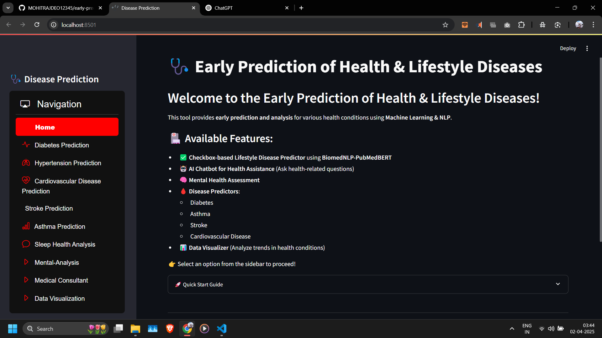
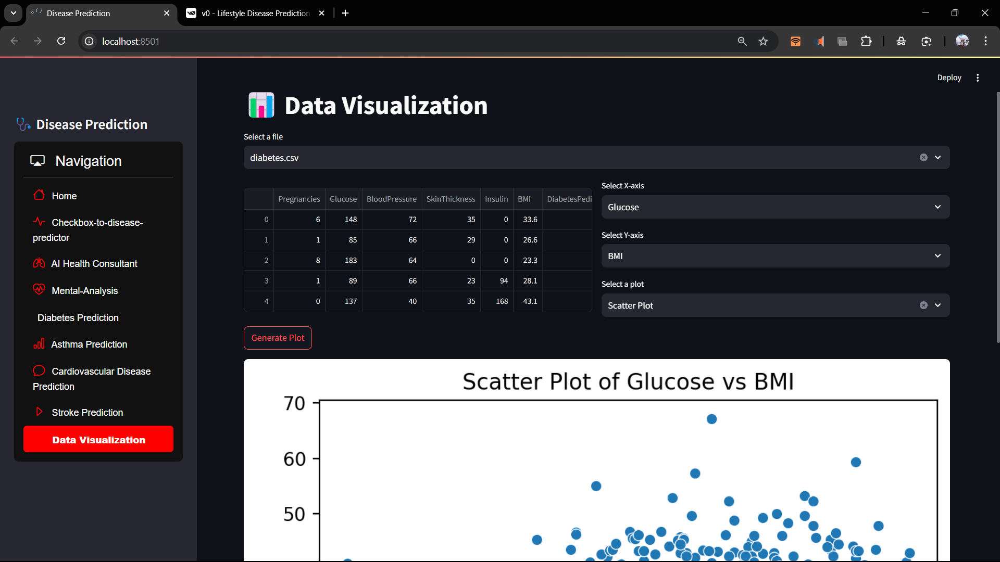
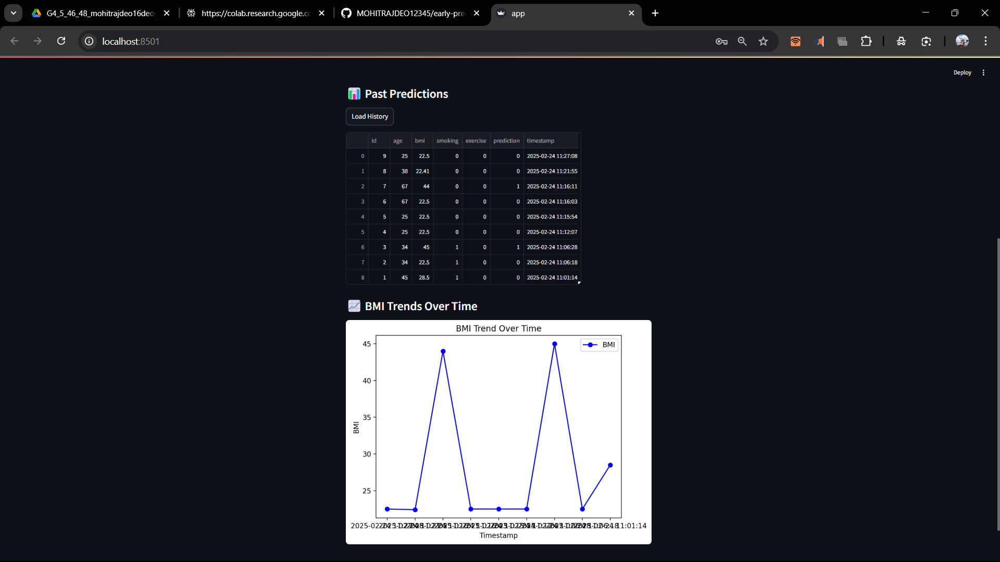
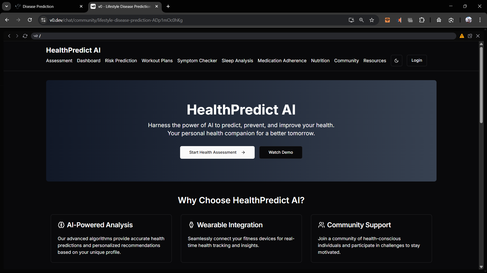

<!-- # 🩺 AI-Powered Health & Lifestyle Disease Prediction

Welcome to the **AI-Powered Health Prediction System**! 🚀

This tool provides **early prediction and analysis** for various health conditions using **Machine Learning & NLP**. It is designed to assist users in understanding potential health risks based on their lifestyle and symptoms.

---

## 🏥 Available Features:

✅ **Lifestyle Disease Predictor** (Checkbox-based system using BiomedNLP-PubMedBERT)

🤖 **AI Chatbot for Health Assistance** (Ask health-related questions)

🧠 **Mental Health Assessment** (Analyze sentiment & well-being)

🩸 **Disease Predictors:**
   - Diabetes
   - Asthma
   - Stroke
   - Cardiovascular Disease

📊 **Data Visualizer** (Analyze trends in health conditions)

🛠 **User-friendly Interface** (Easy navigation and interactive elements)

🔔 **Personalized Health Insights** (Recommendations based on user input)

👉 **Select an option from the sidebar to proceed!**

---

## 🚀 Quick Start Guide

1. Clone this repository:
   ```bash
   git clone https://github.com/MOHITRAJDEO12345/early-prediction-for-ml_proj.git
   ```
2. Navigate to the project directory:
   ```bash
   cd early-prediction-for-ml_proj
   ```
3. Install dependencies:
   ```bash
   pip install -r requirements.txt
   ```
4. Run the application:
   ```bash
   streamlit run app.py
   ```

---

## 🖥 Application Sections

The application includes the following navigation options:

```python
options = [
    'Home',
    'Checkbox-to-disease-predictor',
    'AI Health Consultant',
    'Mental-Analysis',
    'Diabetes Prediction',
    'Asthma Prediction',
    'Cardiovascular Disease Prediction',
    'Stroke Prediction',
    'Sleep Health Analysis',
    'Data Visualization',
    'Text-based Disease Prediction'
]
```

### 🧠 Mental Health Analysis
- NOTE: the trained model was not upto mark so we switched to gated transformer model
- Uses **mental/mental-roberta-base** for sentiment-based mental health assessment.
- Predicts **Depression and Anxiety** based on user input.
- Provides graphical risk assessment using **Seaborn & Matplotlib**.

### 🔬 Disease Prediction Models
- NOTE: only those diseases have been taken that can be predicted wihtout diagnostic results and some of the features have been discared for training
- **Diabetes Model**: Predicts diabetes risk using medical indicators.
- **Asthma Model**: Uses preprocessed datasets to detect asthma likelihood.
- **Cardiovascular Model**: XGBoost-based prediction for heart disease.
- **Stroke Model**: Uses ML models to assess stroke risk factors.

### 📝 Text-based Disease Prediction
- Uses **distilbert-base-uncased** for text-based disease prediction.
- Allows users to input symptoms via text or audio.
- Predicts possible lifestyle diseases based on user input.
- Provides graphical risk assessment using **Seaborn & Matplotlib**.

---

## 📸 Screenshots & UI Preview

🔍 **Streamlit Application Interface:**

- NOTE: for functionality purpose only
- YOUTUBE: https://youtu.be/abrRqceVuDU


📊 **Data Visualization Example:**
- NOTE: currently showing datasets 
it will be used for visualizing anomalies in user predictions it will become personalized



🖥 **Separate Frontend Interface:**
- NOTE: the frontend is currently not connected with ml models and it may behave wrongly
- WORKING: https://v0.dev/chat/community/lifestyle-disease-prediction-ADp1mOc0hKg
- YOUTUBE: https://youtu.be/DU4FW-8hSoU


---

## ⚠️ Disclaimer

This application has been developed using real-world healthcare datasets sourced from Kaggle:

- **Stroke Prediction Dataset**
- **Asthma Analysis & Prediction Dataset**
- **Diabetes Dataset**
- **Cardiovascular Disease Dataset**
- **Sentiment Analysis for Mental Health**

The predictions are generated using machine learning models trained on these datasets, incorporating evaluation metrics and graphical insights to enhance interpretability.

However, this tool has **not undergone clinical validation** and should be used for **informational and educational purposes only**. It is not intended to serve as a substitute for **professional medical diagnosis or treatment**. Always consult a qualified healthcare provider for medical advice.

---

# colab
- https://colab.research.google.com/drive/1DpOH7KgTWubr5qQjj13EDqxIqsbPLDQe?usp=sharing#scrollTo=EgbDF0U5L1l2
- https://colab.research.google.com/drive/1GI7Z1GPPUi67X6UssCQVJXr_QoysfJrz#scrollTo=XkcDpRRzFCIX
- https://colab.research.google.com/drive/1eZIBboyY_x0ZsJp5G10XrFFu4aG4eCuf#scrollTo=3NDJOlrEpmoL
- http://colab.research.google.com/drive/11KO6cvyTeYY_v5PnYqTwheEupJtNjfCr?usp=sharing#scrollTo=7EyXbXJkPnqf
- https://colab.research.google.com/drive/1-B7Q8hXHD0iIBvVldnLkvCiWGhJ2iYNL?usp=sharing
- https://colab.research.google.com/drive/1inXO2_JvTw6fOXiJGaW_0pJvI_3sNo0T?usp=sharing
- https://colab.research.google.com/drive/1NpwO0NBOKQBtUuN9cC-CXE4vuP5TCavY?usp=sharing
- https://colab.research.google.com/drive/10W68SdZHS3IvJAjFTBoqEFI5g7USZVo9?usp=sharing
- https://colab.research.google.com/drive/1J8xvEs7rDn0NLYIzH5S2UgFt-lOk7TA6?usp=sharing
- https://colab.research.google.com/drive/1BeDmCVjVLb3uqUHdnafgLMLItAtgsAsN?usp=sharing
- 
---

## 📌 Modular Features (Pending Integration)

Several functionalities have been implemented but are pending Streamlit integration for optimization:

✅ **User Login & Basic Inputs**: Secure authentication and user profile management.
✅ **Personalized Email Reports**: Automated daily, weekly, and monthly health insights.
✅ **Anomaly Visualization**: Analyzes past predictions to detect anomalies.
✅ **Workout Plans**: AI-driven personalized workout routines based on health data.
✅ **Sleep Analysis**: AI-powered sleep tracking and recommendations.
✅ **Medication Adherence**: Reminders and tracking for prescribed medications.
✅ **Nutrition Recommendations**: AI-based meal planning and dietary suggestions.
✅ **Community & Resources**: A section for health articles, discussions, and expert Q&A.

---

## 🔬 Ongoing Research & Future Enhancements

🚧 **Fitbit API Integration** – Real-time health monitoring with wearable devices.
🚧 **LSTM Models for Realtime Fitbit Data** – Developing deep learning models for dynamic health tracking.
🚧 **Enhanced Mental Health Analysis** – Exploring transformer-based sentiment models for deeper insights.
🚧 **Hybrid ML & NLP Systems** – Combining structured health data with unstructured text for more accurate predictions.

---

## 👨‍💻 Author

Developed by **Mohit Rajdeo**  
GitHub: [MOHITRAJDEO12345](https://github.com/MOHITRAJDEO12345)

---

## 🤝 Contributions

Contributions are always welcome! Feel free to open an issue or submit a pull request if you have suggestions or improvements.

---

## 📬 Contact

For any questions or feedback, feel free to reach out:

📧 Email: mohitrajdeo16deoghar@gmail.com  
🐦 Twitter: [@mohitrajdeo](https://twitter.com/mohitrajdeo) -->


# 🩺 Early Prediction of Health & Lifestyle Diseases

Welcome to the **AI-Powered Health Prediction System**! 🚀

This tool provides **early prediction and analysis** for various health conditions using **Machine Learning & NLP**. It assists users in understanding potential health risks based on their lifestyle, medical indicators, and symptoms.

---

## 🏥 Available Features:

✅ **Diabetes Prediction** – Predict diabetes risk using medical indicators.

✅ **Hypertension Prediction** – Assess the risk of high blood pressure.

✅ **Cardiovascular Disease Prediction** – XGBoost-based prediction for heart disease.

✅ **Stroke Prediction** – Machine Learning-based stroke risk analysis.

✅ **Asthma Prediction** – Detect asthma likelihood using preprocessed datasets.

✅ **Sleep Health Analysis** – AI-driven analysis of sleep patterns and health.

✅ **Mental Health Assessment** – Sentiment-based analysis using **mental-roberta-base**.

✅ **Medical Consultant AI Chatbot** – Ask health-related questions for AI-driven insights.

✅ **Data Visualization** – Graphical representation of health trends and anomalies.

👉 **Select an option from the sidebar to proceed!**

---

## 🚀 Quick Start Guide

1. Clone this repository:
   ```bash
   git clone https://github.com/MOHITRAJDEO12345/early-prediction-for-ml_proj.git
   ```
2. Navigate to the project directory:
   ```bash
   cd early-prediction-for-ml_proj
   ```
3. Install dependencies:
   ```bash
   pip install -r requirements.txt
   ```
4. Run the application:
   ```bash
   streamlit run app.py
   ```

---

## 🖥 Application Sections

The application includes the following navigation options:

```python
options = [
    'Home',
    'Diabetes Prediction',
    'Hypertension Prediction',
    'Cardiovascular Disease Prediction',
    'Stroke Prediction',
    'Asthma Prediction',
    'Sleep Health Analysis',
    'Mental-Analysis',
    'Medical Consultant',
    'Data Visualization'
]
```

### 🧠 Mental Health Analysis
- Uses **mental/mental-roberta-base** for sentiment-based mental health assessment.
- Predicts **Depression and Anxiety** based on user input.
- Provides graphical risk assessment using **Seaborn & Matplotlib**.

### 🔬 Disease Prediction Models
- **Diabetes Model**: Predicts diabetes risk based on medical data.
- **Hypertension Model**: Evaluates high blood pressure risk.
- **Cardiovascular Model**: Uses XGBoost for heart disease prediction.
- **Stroke Model**: ML-based assessment of stroke risk factors.
- **Asthma Model**: Machine learning model for asthma detection.

### 📊 Data Visualization
- Interactive graphs to analyze health trends.
- Anomaly detection for user predictions.

### 🤖 AI Medical Consultant
- AI-powered chatbot for answering health-related queries.
- Uses NLP models for better understanding and recommendations.

---

## 📸 Screenshots & UI Preview

🔍 **Streamlit Application Interface:**
- NOTE: for functionality purpose only
- YOUTUBE: https://youtu.be/abrRqceVuDU


📊 **Data Visualization Example:**
- NOTE: currently showing datasets 
it will be used for visualizing anomalies in user predictions it will become personalized


🖥 **Separate Frontend Interface:**
- NOTE: the frontend is currently not connected with ml models and it may behave wrongly
- WORKING: https://v0.dev/chat/community/lifestyle-disease-prediction-ADp1mOc0hKg
- YOUTUBE: https://youtu.be/DU4FW-8hSoU


---
# colab
- https://colab.research.google.com/drive/1DpOH7KgTWubr5qQjj13EDqxIqsbPLDQe?usp=sharing#scrollTo=EgbDF0U5L1l2
- https://colab.research.google.com/drive/1GI7Z1GPPUi67X6UssCQVJXr_QoysfJrz#scrollTo=XkcDpRRzFCIX
- https://colab.research.google.com/drive/1eZIBboyY_x0ZsJp5G10XrFFu4aG4eCuf#scrollTo=3NDJOlrEpmoL
- http://colab.research.google.com/drive/11KO6cvyTeYY_v5PnYqTwheEupJtNjfCr?usp=sharing#scrollTo=7EyXbXJkPnqf
- https://colab.research.google.com/drive/1-B7Q8hXHD0iIBvVldnLkvCiWGhJ2iYNL?usp=sharing
- https://colab.research.google.com/drive/1inXO2_JvTw6fOXiJGaW_0pJvI_3sNo0T?usp=sharing
- https://colab.research.google.com/drive/1NpwO0NBOKQBtUuN9cC-CXE4vuP5TCavY?usp=sharing
- https://colab.research.google.com/drive/10W68SdZHS3IvJAjFTBoqEFI5g7USZVo9?usp=sharing
- https://colab.research.google.com/drive/1J8xvEs7rDn0NLYIzH5S2UgFt-lOk7TA6?usp=sharing
- https://colab.research.google.com/drive/1BeDmCVjVLb3uqUHdnafgLMLItAtgsAsN?usp=sharing
- 
---
## ⚠️ Disclaimer

This application has been developed using real-world healthcare datasets sourced from Kaggle:

- **Diabetes Dataset**
- **Hypertension Dataset**
- **Cardiovascular Disease Dataset**
- **Stroke Prediction Dataset**
- **Asthma Analysis & Prediction Dataset**
- **Sentiment Analysis for Mental Health**

The predictions are generated using machine learning models trained on these datasets, incorporating evaluation metrics and graphical insights to enhance interpretability.

However, this tool has **not undergone clinical validation** and should be used for **informational and educational purposes only**. It is not intended to serve as a substitute for **professional medical diagnosis or treatment**. Always consult a qualified healthcare provider for medical advice.

---

## 📌 Modular Features (Pending Integration)

Several functionalities have been implemented but are pending Streamlit integration for optimization:

✅ **User Login & Basic Inputs**: Secure authentication and user profile management.
✅ **Personalized Email Reports**: Automated daily, weekly, and monthly health insights.
✅ **Anomaly Visualization**: Analyzes past predictions to detect anomalies.
✅ **Workout Plans**: AI-driven personalized workout routines based on health data.
✅ **Sleep Analysis**: AI-powered sleep tracking and recommendations.
✅ **Medication Adherence**: Reminders and tracking for prescribed medications.
✅ **Nutrition Recommendations**: AI-based meal planning and dietary suggestions.
✅ **Community & Resources**: A section for health articles, discussions, and expert Q&A.

---

# 🔬 Ongoing Research & Future Enhancements

🚧 **Fitbit API Integration** – Real-time health monitoring with wearable devices.
🚧 **LSTM Models for Realtime Fitbit Data** – Developing deep learning models for dynamic health tracking.
🚧 **Enhanced Mental Health Analysis** – Exploring transformer-based sentiment models for deeper insights.
🚧 **Hybrid ML & NLP Systems** – Combining structured health data with unstructured text for more accurate predictions.

---

## 👨‍💻 Author

Developed by **Mohit Rajdeo**  
GitHub: [MOHITRAJDEO12345](https://github.com/MOHITRAJDEO12345)

---

## 🤝 Contributions

Contributions are always welcome! Feel free to open an issue or submit a pull request if you have suggestions or improvements.

---

## 📬 Contact

For any questions or feedback, feel free to reach out:

📧 Email: mohitrajdeo16deoghar@gmail.com  
🐦 Twitter: [@mohitrajdeo](https://twitter.com/mohitrajdeo)

